<p align="center">
  <picture>
    <source media="(prefers-color-scheme: dark)" srcset="docs/images/logo-banner-dark.webp">
    
  </picture>
</p>

<p align="center">
  <strong>Scholarly Restraint Meets Editorial Elegance.</strong><br>
  A static, magazine-style personal homepage generator crafted for researchers, engineers, and creators.
</p>

<p align="center">
  <a href="https://stlin256.github.io/OpenHomepage-V2/"></a>
  <a href="https://github.com/stlin256/OpenHomepage-V2/actions/workflows/deploy.yml"></a>
  <a href="https://astro.build"></a>
  <a href="https://www.typescriptlang.org/"></a>
  <a href="https://vitest.dev/"></a>
  <a href="LICENSE"></a>
  <a href="https://deepwiki.com/stlin256/OpenHomepage-V2"></a>
</p>

<p align="center">
  <a href="#-core-capabilities">⚡ Core Capabilities</a> ·
  <a href="#-component-gallery">🎨 Gallery</a> ·
  <a href="#-markdown-directives-cheat-sheet">📝 Directives</a> ·
  <a href="#-quick-start">🚀 Quick Start</a> ·
  <a href="#-local-visual-editor">🎛️ Admin Console</a> ·
  <a href="#-deployment--cicd">🌐 Deployment</a> ·
  <a href="README.zh-CN.md">中文文档</a>
</p>

---

**OpenHomepage V2** is a lightweight, static personal homepage generator built on Astro. Featuring scholarly restraint and modern magazine typography, its content and layout are driven entirely by plain Markdown and YAML configuration files in your local `data/` directory, and deployed seamlessly to GitHub Pages via GitHub Actions.

> [!TIP]
> **Out-of-the-Box Experience**: The repository bundles a complete 4-language sample dataset (`data.example/`). You can clone the repo and immediately preview or build the site without any extra configuration.

---

## Table of Contents

- [⚡ Core Capabilities](#-core-capabilities)
- [🎨 Component Gallery](#-component-gallery)
  - [1. Homepage & Dynamic Streams](#1-homepage--dynamic-streams)
  - [2. Academic Publishing & Markdown Directives](#2-academic-publishing--markdown-directives)
  - [3. Global UI, Media & Multilingual Architecture](#3-global-ui-media--multilingual-architecture)
- [📝 Markdown Directives Cheat Sheet](#-markdown-directives-cheat-sheet)
- [🚀 Quick Start](#-quick-start)
- [💻 CLI Commands](#-cli-commands)
- [🎛️ Local Visual Editor](#️-local-visual-editor)
- [🌐 Deployment & CI/CD](#-deployment--cicd)
- [📁 Project Structure](#-project-structure)
- [📄 License & Acknowledgements](#-license--acknowledgements)

---

## ⚡ Core Capabilities

<table>
  <tr>
    <td width="50%" valign="top">
      <h3>🎨 Editorial Typography & Aesthetic Grid</h3>
      <ul>
        <li><strong>Asymmetric 12-Column Magazine Grid</strong>: Restrained white-space and editorial layouts that collapse smoothly to single-column on mobile viewports.</li>
        <li><strong>Zero-Flash Dual Themes</strong>: Automatically adapts to system dark/light preferences with session persistence and configurable accent palettes.</li>
        <li><strong>Hardware-Accelerated Micro-Interactions</strong>: Lightweight Transform / Opacity transitions that strictly honor <code>prefers-reduced-motion</code>.</li>
      </ul>
    </td>
    <td width="50%" valign="top">
      <h3>📝 Academic & Rich Media Pipeline</h3>
      <ul>
        <li><strong>Academic Publications (<code>::publications</code>)</strong>: Multi-dimensional filtering, categorized grouping, 1-click BibTeX copy, and smooth abstract accordion.</li>
        <li><strong>Rich Interactive Footnotes (<code>[^1]</code>)</strong>: Desktop popover bubbles with viewport collision handling; mobile slide-up sheets with backlink jumps.</li>
        <li><strong>Scholarly Typesetting</strong>: Native KaTeX formulas, Shiki dual-theme code highlighting, milestone timelines, and semantic magazine callouts.</li>
      </ul>
    </td>
  </tr>
  <tr>
    <td width="50%" valign="top">
      <h3>⚡ Extreme Performance & Prefetch Pipeline</h3>
      <ul>
        <li><strong>Automated Responsive AVIF / WebP Derivation</strong>: Generates layout-derived 1x / 2x / 3x density candidates; serves AVIF via <code>&lt;picture&gt;</code> with WebP fallback.</li>
        <li><strong>Aggressive Idle Prefetch & Shared Cache</strong>: Prefetches multilingual alternates and tabs during browser idle, making navigation instantaneous.</li>
        <li><strong>Speculation Rules Pre-warming</strong>: Chromium hover prefetching paired with pure static output for sub-second page delivery.</li>
      </ul>
    </td>
    <td width="50%" valign="top">
      <h3>🎛️ Local On-Page Visual Editor</h3>
      <ul>
        <li><strong>WYSIWYG Editing on Real Rendered Pages</strong>: Hover outlines, in-place text editing, directive parameter inspector, block drag & drop, and undo/redo (<code>Ctrl+Z</code>).</li>
        <li><strong>Full-Site Configuration & Source Fallback</strong>: Site settings, palette picker, automatic favicon crop, and raw whole-page Markdown source editor.</li>
        <li><strong>Snapshots & One-Click Export</strong>: Autosaves on idle, backs up versions in <code>.snapshots/</code> for rollback, and exports <code>data.zip</code> in one click.</li>
      </ul>
    </td>
  </tr>
  <tr>
    <td width="50%" valign="top">
      <h3>🌐 Zero-Friction Multilingual Setup</h3>
      <ul>
        <li><strong>Folder-as-Routing</strong>: Adding subdirectories under <code>data/pages/&lt;lang&gt;/</code> activates routes, navigation tabs, and multilingual configs automatically.</li>
        <li><strong>Graceful Fallback Chain</strong>: Untranslated pages fall back silently; ships with complete 中文, English, 日本語, and Français demo content.</li>
        <li><strong>Global Multilingual Search</strong>: <code>Ctrl+K</code> opens a frosted-glass command palette with CJK tokenization and instant language scope switching.</li>
      </ul>
    </td>
    <td width="50%" valign="top">
      <h3>🛡️ Privacy-First & Decoupled CI/CD</h3>
      <ul>
        <li><strong>Complete Data Privacy Decoupling</strong>: Your real <code>data/</code> directory remains strictly git-ignored; code is public while personal data stays private.</li>
        <li><strong>Fail-Safe Snapshot Recovery</strong>: GitHub Actions fetches private data from a secret URL and falls back to the previous successful snapshot if offline.</li>
        <li><strong>Original Feed Syndication</strong>: Automatically builds RSS 2.0 (<code>/feed.xml</code>), Atom 1.0 (<code>/feed.atom.xml</code>), and JSON Feed 1.1 (<code>/feed.json</code>).</li>
      </ul>
    </td>
  </tr>
</table>

---

## 🎨 Component Gallery

Every screenshot below is captured directly from the static production build via Playwright (`npm run screenshots`) — **what you see is exactly what ships**.

### 1. Homepage & Dynamic Streams

<table>
  <tr>
    <td width="50%" align="center">
      <b>Profile Block (Light Theme)</b><br>
      <sub>Automatic avatar palette extraction, bio, and social/academic links</sub><br><br>
      
    </td>
    <td width="50%" align="center">
      <b>Profile Block (Dark Theme)</b><br>
      <sub>Warm dark background, contrast-adjusted accents, and seamless toggle</sub><br><br>
      
    </td>
  </tr>
  <tr>
    <td width="50%" align="center">
      <b>LLM Typewriter Streaming Block (<kbd>::stream</kbd>)</b><br>
      <sub>Simulated typewriter playback of pre-written Markdown with speed control</sub><br><br>
      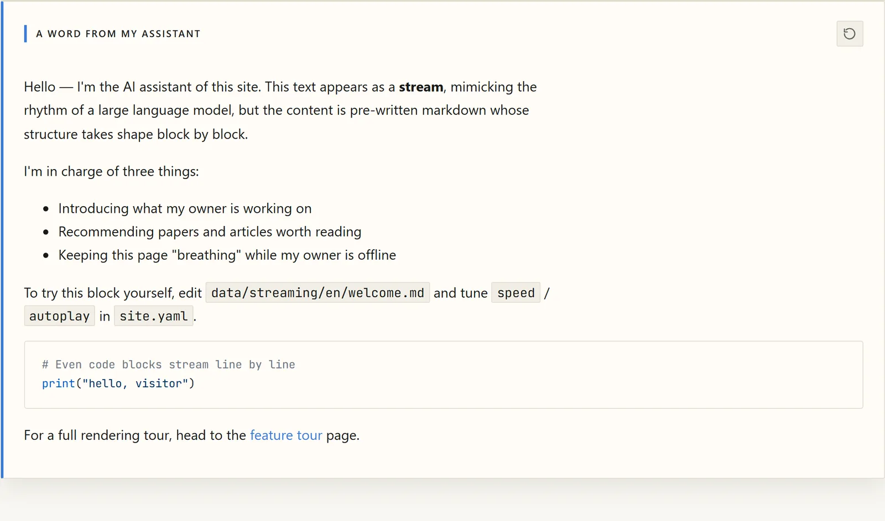
    </td>
    <td width="50%" align="center">
      <b>GitHub Contribution Heatmap</b><br>
      <sub>GraphQL-prefetched calendar with 5-level accent scales and day tooltips</sub><br><br>
      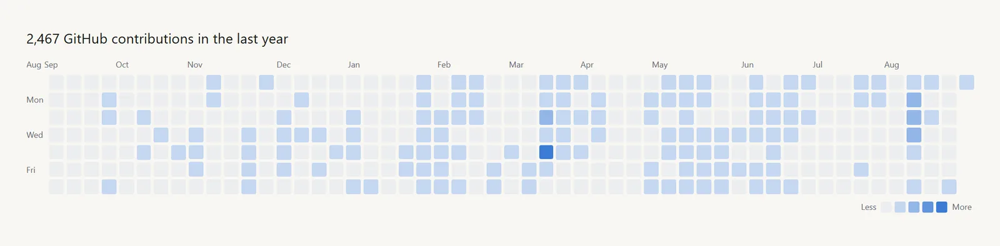
    </td>
  </tr>
  <tr>
    <td width="50%" align="center">
      <b>Pinned Repository Cards</b><br>
      <sub>1:1 GitHub design: language dots, star/fork counts, and relative timestamps</sub><br><br>
      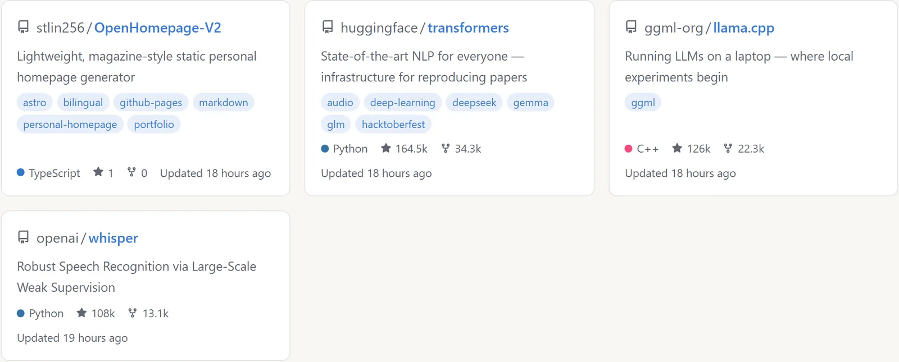
    </td>
    <td width="50%" align="center">
      <b>Multi-Source RSS Article Feed (RssBlock)</b><br>
      <sub>Supports latest sorting and curated picks with lazy-loaded covers</sub><br><br>
      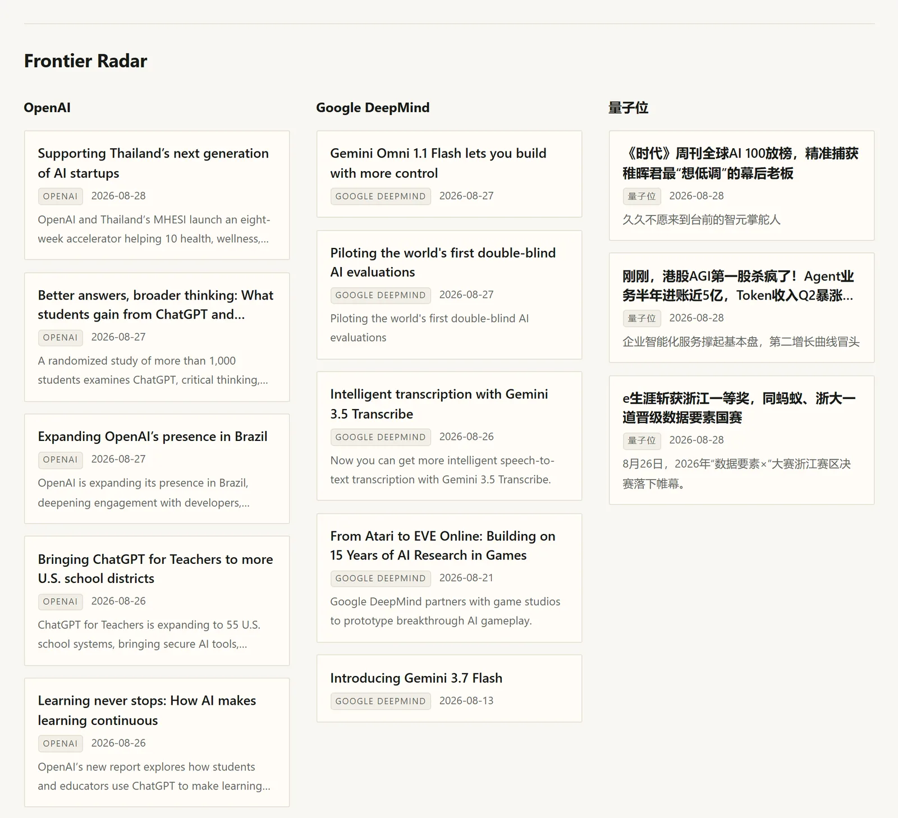
    </td>
  </tr>
  <tr>
    <td width="50%" align="center">
      <b>Editorial Block: Actions & List Cards (<kbd>::editorial</kbd>)</b><br>
      <sub>Action button groups and numbered list cards defined in <code>site.yaml</code></sub><br><br>
      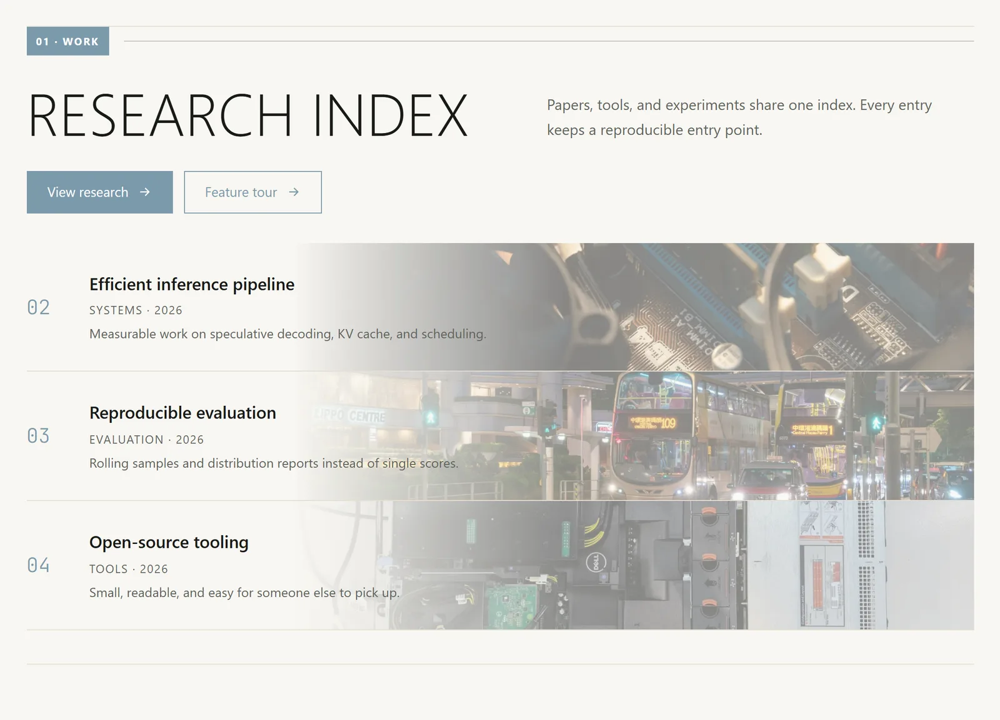
    </td>
    <td width="50%" align="center">
      <b>Editorial Block: Tiles & Archive Cards (<kbd>::editorial</kbd>)</b><br>
      <sub>Visual image tiles, archive cards, and editorial section dividers</sub><br><br>
      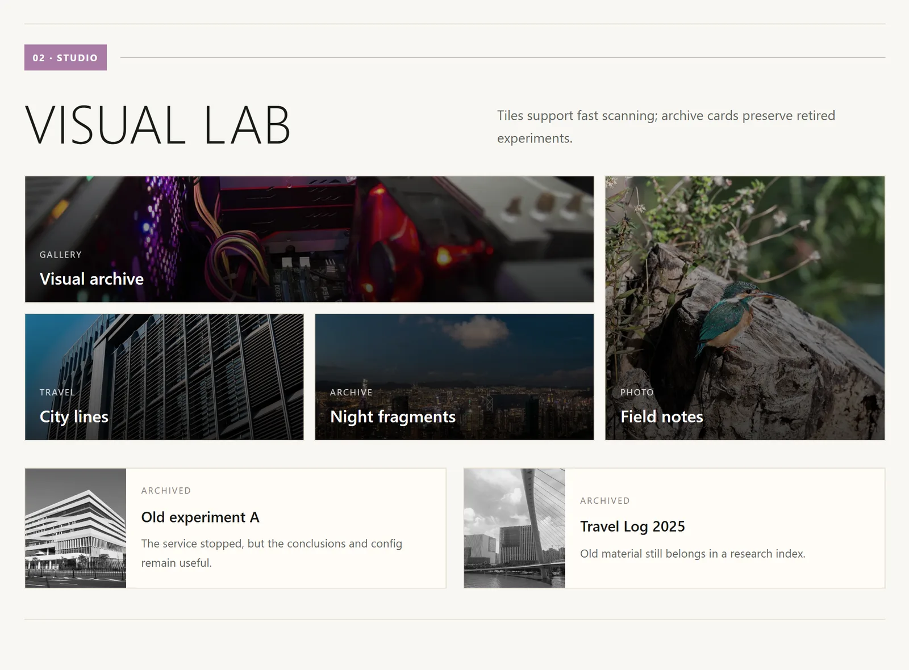
    </td>
  </tr>
</table>

### 2. Academic Publishing & Markdown Directives

<table>
  <tr>
    <td width="50%" align="center">
      <b>Academic Publications List (<kbd>::publications</kbd>)</b><br>
      <sub>Build-time filtering and grouping with 1-click BibTeX copy and abstract accordion</sub><br><br>
      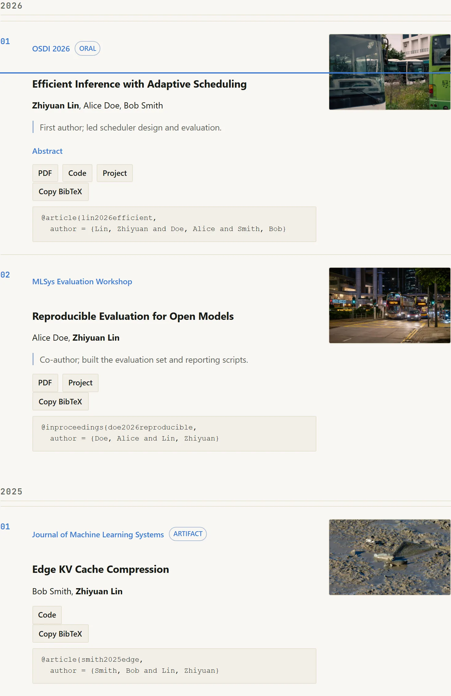
    </td>
    <td width="50%" align="center">
      <b>Rich Interactive Footnotes (<kbd>[^1]</kbd>)</b><br>
      <sub>Desktop popover bubbles with viewport collision handling & mobile bottom sheets</sub><br><br>
      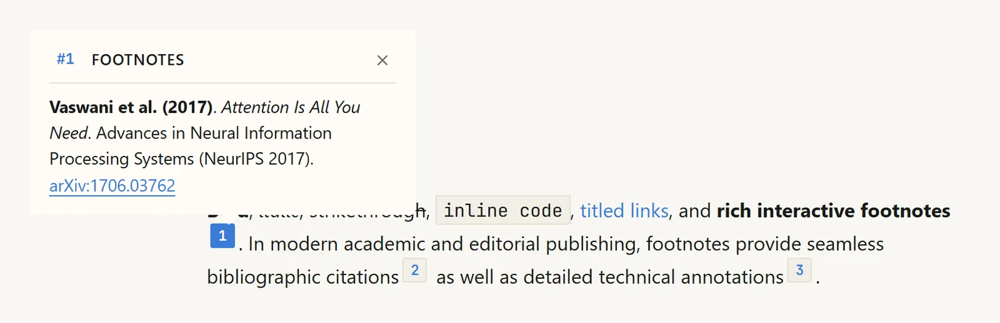
    </td>
  </tr>
  <tr>
    <td width="50%" align="center">
      <b>Experience & Education Timeline (<kbd>::::timeline</kbd>)</b><br>
      <sub>Minimalist editorial timeline with milestone indicators and responsive layouts</sub><br><br>
      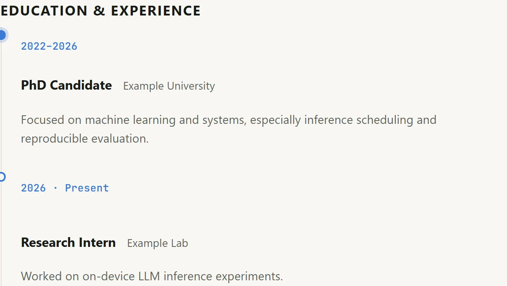
    </td>
    <td width="50%" align="center">
      <b>Editorial Callout Cards (<kbd>:::note</kbd> / <kbd>:::tip</kbd> etc.)</b><br>
      <sub>Zero-JS semantic callout boxes adapting to theme accents and dark mode</sub><br><br>
      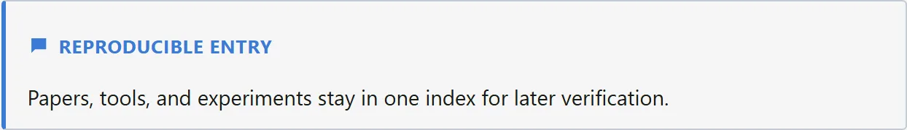
    </td>
  </tr>
  <tr>
    <td width="50%" align="center">
      <b>KaTeX Mathematics</b><br>
      <sub>Inline <code>$...$</code> and display math equations rendered natively at build time</sub><br><br>
      
    </td>
    <td width="50%" align="center">
      <b>Shiki Dual-Theme Code Highlighting</b><br>
      <sub>Inline styles generated by Shiki, synchronized smoothly across site themes</sub><br><br>
      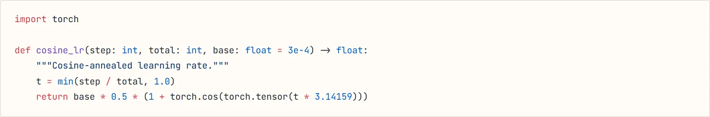
    </td>
  </tr>
  <tr>
    <td width="50%" align="center">
      <b>Structured Figures & Captions (<kbd>:::figure</kbd>)</b><br>
      <sub>Explicit width constraints (<code>%/px/vw</code>), alignments, and styled captions</sub><br><br>
      
    </td>
    <td width="50%" align="center">
      <b>12-Column Magazine Grid (<kbd>::::grid</kbd>)</b><br>
      <sub>Asymmetric multi-column container that collapses gracefully on mobile screens</sub><br><br>
      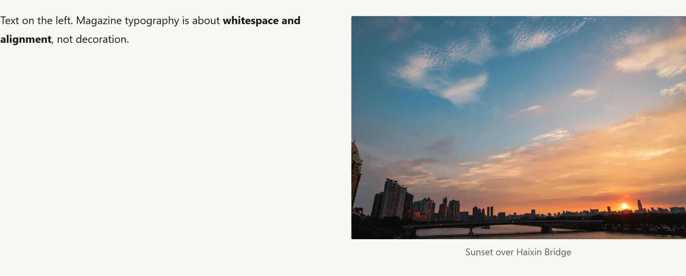
    </td>
  </tr>
  <tr>
    <td width="50%" align="center">
      <b>Custom Audio Player (<kbd>:::audio</kbd>)</b><br>
      <sub>Lightweight custom player with marquee title and intelligent BGM auto-resume</sub><br><br>
      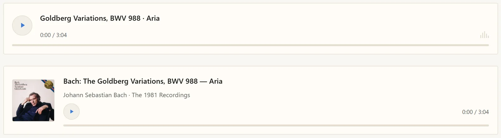
    </td>
    <td width="50%" align="center">
      <b>Responsive Video Embeds (<kbd>::bilibili</kbd> / <kbd>::youtube</kbd>)</b><br>
      <sub>16:9 official-style facade with auto-resolved titles; iframes load only on click</sub><br><br>
      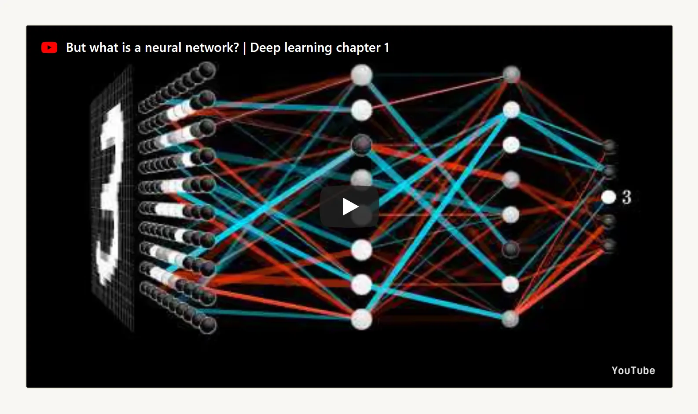
    </td>
  </tr>
  <tr>
    <td width="50%" align="center">
      <b>Inline GitHub Repo Card (<kbd>::ghcard</kbd>)</b><br>
      <sub>Embed any pinned GitHub repository card anywhere inside Markdown content</sub><br><br>
      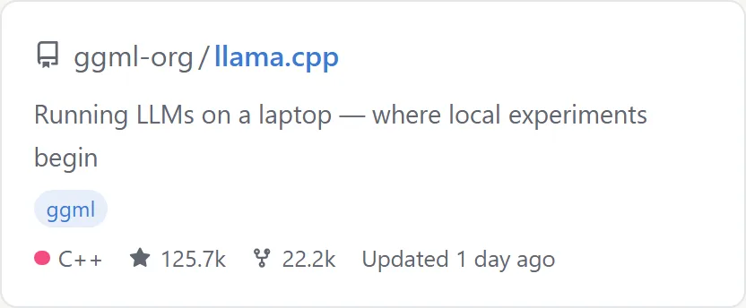
    </td>
    <td width="50%" align="center">
      <b>Table of Contents & Progress Bar (<kbd>toc: true</kbd>)</b><br>
      <sub>Sticky desktop sidebar, mobile drawer navigation, and top 2px reading line</sub><br><br>
      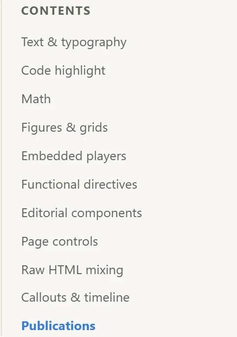
    </td>
  </tr>
</table>

### 3. Global UI, Media & Multilingual Architecture

<table>
  <tr>
    <td width="50%" align="center">
      <b>Global Static Search (<kbd>Ctrl+K</kbd> / <kbd>Cmd+K</kbd>)</b><br>
      <sub>Instant modal with language scope toggle (current/all), CJK tokenization & shortcuts</sub><br><br>
      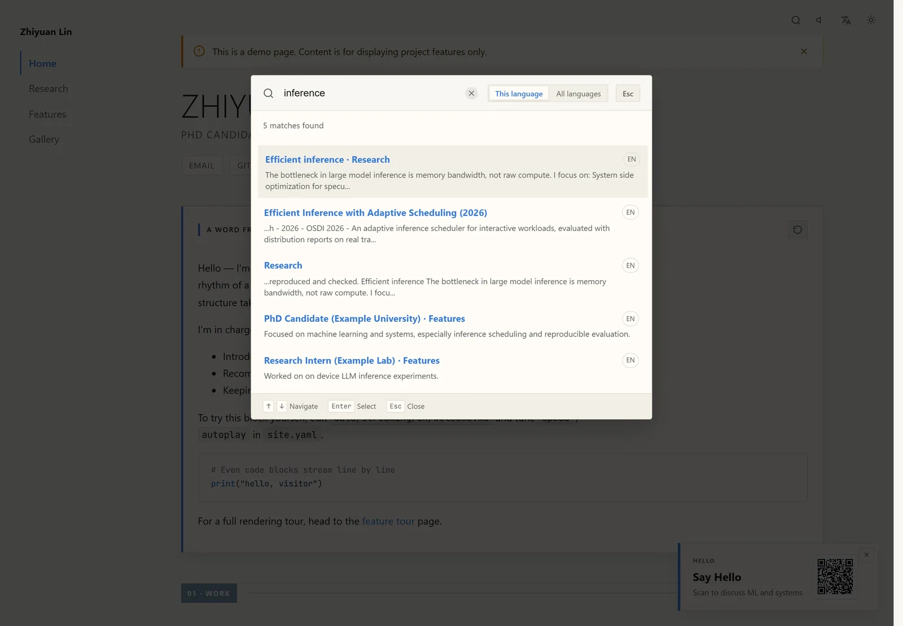
    </td>
    <td width="50%" align="center">
      <b>BGM Playlist & Mini Player Drawer</b><br>
      <sub>Multi-track playlist drawer, track navigation, volume memory, and auto-resume</sub><br><br>
      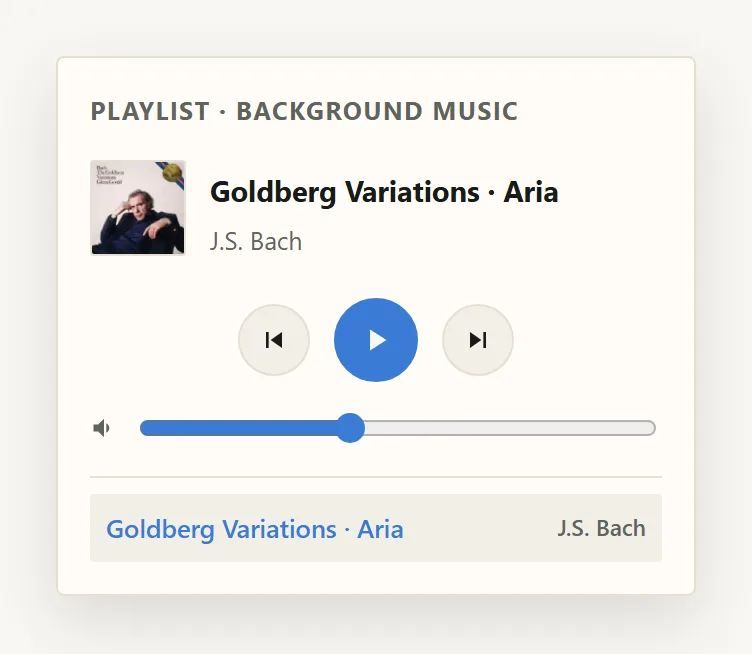
    </td>
  </tr>
  <tr>
    <td width="50%" align="center">
      <b>Multilingual Language Switcher</b><br>
      <sub>Subdirectory routing with bundled EN / ZH / JA / FR demos and graceful fallback</sub><br><br>
      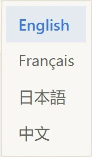
    </td>
    <td width="50%" align="center">
      <b>Header Tools Bar</b><br>
      <sub>Persistent BGM button, language menu, search trigger, and zero-flash theme toggle</sub><br><br>
      
    </td>
  </tr>
  <tr>
    <td width="50%" align="center">
      <b>Photo Gallery Grid</b><br>
      <sub>Captioned responsive photo gallery; clicking any photo opens the full-screen lightbox</sub><br><br>
      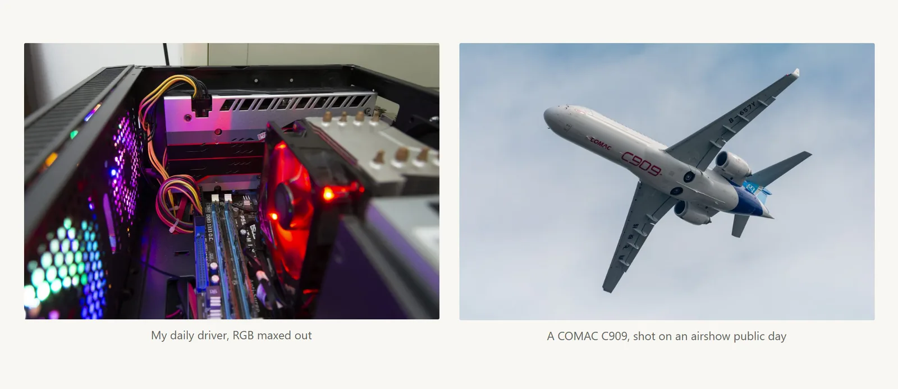
    </td>
    <td width="50%" align="center">
      <b>Full-Screen Image Lightbox</b><br>
      <sub>Automatic matching of <code>-full</code> HD variants, smooth zooming, and Esc exit</sub><br><br>
      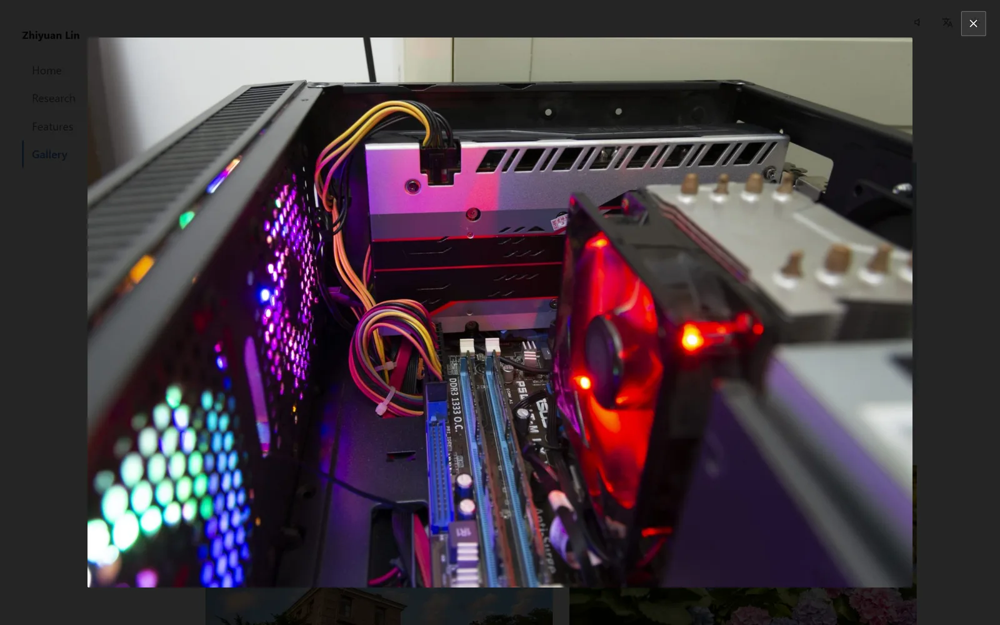
    </td>
  </tr>
  <tr>
    <td width="50%" align="center">
      <b>Floating Contact Card (ContactCard)</b><br>
      <sub>Delicate micro-card that slides in from bottom-right to open the QR modal</sub><br><br>
      
    </td>
    <td width="50%" align="center">
      <b>Full-Screen QR Code Modal</b><br>
      <sub>Frosted-glass full-screen modal for quick mobile scanning or sponsorship links</sub><br><br>
      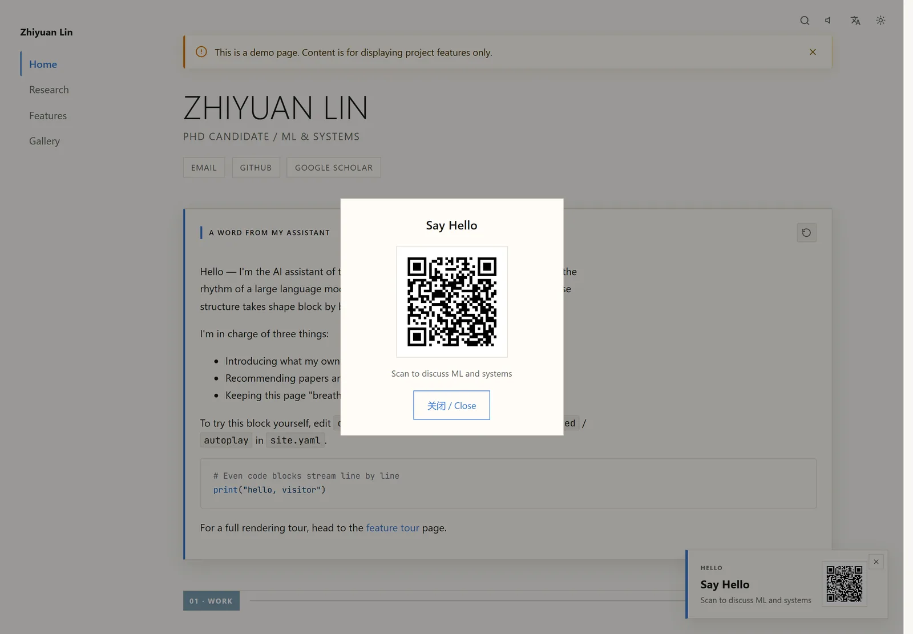
    </td>
  </tr>
  <tr>
    <td colspan="2" align="center">
      <b>Page Announcement Banner (NoticeBanner)</b><br>
      <sub>Per-page frontmatter-configured top banner supporting theme, yellow, red, or custom colors</sub><br><br>
      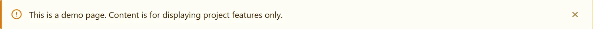
    </td>
  </tr>
</table>

---


## 📝 Markdown Directives Cheat Sheet

Use these expressive directives in any `.md` file to unlock magazine-quality typography:

| Directive Syntax | Render Type | Key Parameters & Description | Best For |
|---|---|---|---|
| `::publications{category="journal"}` | Block | Reads `data/publications.yaml`, supports multidimensional filtering, grouping & BibTeX copy | Academic papers, preprints, conference publications |
| `[^1]` & `[^1]: Note` | Inline / End | Desktop popover bubble (collision-aware), mobile bottom drawer with smooth backlink jumps | Academic citations, glossaries, DOI links |
| `::::timeline` / `:::timeline-item` | Container | Clean editorial timeline supporting `date`, `title`, `org`, `description` | Career milestones, education history, releases |
| `:::note` / `:::tip` / `:::warning` / `:::important` / `:::quote` | Container | Zero-JS semantic callout boxes adapting to theme accents and dark mode | Key takeaways, tips, warnings, block quotes |
| `::stream{id="welcome" replay="true"}` | Block | Simulated LLM typewriter playback for pre-written Markdown with speed control | Dynamic introductions, welcome manifestos |
| `::::grid{cols=2}` / `:::cell` | Container | 12-column asymmetric magazine grid that collapses gracefully on mobile | Multi-column layouts, mixed media columns |
| `:::figure{src="..." caption="..." width="70%" align="center"}` | Container | Structured figure block supporting width bounds (`%/px/vw`), alignment & styled captions | Scientific figures, design mockups, photos |
| `:::audio{src="..." title="..." cover="..." mode="card"}` | Container | Custom audio player with marquee text and intelligent background music mutual exclusion | Music tracks, podcast previews, voice clips |
| `::bilibili{bvid="..."}` / `::youtube{id="..."}` | Block | 16:9 responsive facade card with cover and title; iframe fetches only upon user click | Video embeds without hurting initial page speed |
| `:::video{src="..." poster="..."}` | Container | Native HTML5 responsive video card with custom poster image and controls | Self-hosted or short video showcases |
| `::ghcard{repo="owner/repo"}` | Block | Embeds an official 1:1 GitHub repository card anywhere in Markdown | Open-source tools, recommended repositories |
| `::editorial{id="features"}` | Block | Injects complete editorial sections (buttons, numbered lists, tiles, archive cards) | Feature matrices, curated showcase grids |

---

## 🚀 Quick Start

### Prerequisites
- **Node.js**: `>= 18.17.0` (Node 24+ recommended)
- **Package Manager**: `npm` / `pnpm` / `yarn`

### 4-Step Quick Launch

```bash
# 1. Clone repository
git clone https://github.com/stlin256/OpenHomepage-V2.git
cd OpenHomepage-V2

# 2. Install dependencies
npm install

# 3. Initialize local data directory (creates data/ from sample)
npm run setup

# 4. Start local development server
npm run dev
```

Open `http://localhost:4321` in your browser to view the site!

> [!NOTE]
> If you have not run `npm run setup`, the site will automatically fall back to `data.example/` for instant preview and building.

---

## 💻 CLI Commands

| Command | Description | Default URL | Lifecycle |
|---|---|---|---|
| `npm run admin` | **Launch local visual editor** (manages companion preview server automatically) | `http://127.0.0.1:4174` | Press `Ctrl+C` to terminate both |
| `npm run dev` | Astro dev server with Vite Hot Module Reloading (HMR) | `http://localhost:4321` | Press `Ctrl+C` to stop |
| `npm run build` | **Execute static production build** with automated WebP + AVIF derivation | — | Exits on completion |
| `npm run preview` | Preview production output in `dist/` locally | `http://localhost:4321` | Press `Ctrl+C` to stop |
| `npm run serve` | **Standalone production static server** (supports custom ports & HTTPS) | `http://localhost:8080` | Press `Ctrl+C` to stop |
| `npm test` | Run Vitest unit and integration test suites | — | Exits on completion |
| `npm run prefetch` | Fetch remote GitHub activity and RSS articles into `.cache/` | — | Exits on completion |
| `npm run screenshots` | Regenerate all README component gallery screenshots via Playwright | — | Exits on completion |

---

## 🎛️ Local Visual Editor

Launch the admin workspace locally in your terminal:

```bash
npm run admin       # Visit http://127.0.0.1:4174 (secure loopback address only)
```

- **WYSIWYG on Real Rendered Pages**: Click "Visual Editing" to edit directly on the rendered page — hover outlines, in-place text editing, a right-side inspector for directive parameters and grid columns, block insertion/drag-reordering, `Ctrl+Z` undo/redo, and a typewriter streaming modal with live preview.
- **Full-Site Visual Configuration**: Easily manage site details, social links, smart palette extraction from avatar, custom accent colors, automatic favicon generation, BGM playlist management, and GitHub/RSS subscriptions.
- **Markdown Source Fallback**: Retains a frontmatter form and raw full-page Markdown editor with idle autosaving (~1.5s).
- **Autosave & Historical Snapshots**: Every edit automatically archives the previous version to `data/.snapshots/` for seamless rollback.
- **One-Click Data Export**: Top navigation exports the entire workspace as `data.zip`, ready for secure hosting or automated CI consumption.

---

## 🌐 Deployment & CI/CD

The project includes an automated GitHub Actions workflow (`.github/workflows/deploy.yml`). Building is triggered on every push to the `main` branch or automatically on an 8-hour schedule, deploying directly to GitHub Pages.

### GitHub Secrets Configuration

| Secret | Requirement | Purpose & Description |
|---|---|---|
| `ENABLE_EXAMPLE` | Optional | Set to `true` to deploy the public demo showcase using bundled `data.example/` |
| `DATA_SOURCE_URL` | Required for private data | Direct download URL to your private `data.zip` archive |
| `GH_PAT` | Optional | Personal Access Token (`read:user`) for complete GitHub contribution calendar GraphQL API |

### Fail-Safe Snapshot Disaster Recovery
- **Snapshot Recovery**: If `DATA_SOURCE_URL` becomes unreachable, CI automatically restores `data-snapshot.zip` from the previous successful deployment, refreshes dynamic GitHub/RSS data, and publishes successfully to prevent any downtime.
- **Email Alert Trigger**: When a snapshot recovery occurs, the workflow terminates with an alert notice to notify repository maintainers via GitHub's native email notifications.

---

## 📁 Project Structure

```
OpenHomepage-V2/
├── data.example/        # Bundled sample data and media assets (tracked in git)
│   ├── site.yaml        # Core site configuration (theme, navigation, profile)
│   ├── publications.yaml# Academic papers and publication records
│   ├── rss.yaml         # Multi-source RSS subscription feeds
│   ├── pages/<lang>/    # Multilingual Markdown page content
│   └── streaming/       # Pre-written typewriter streaming blocks
├── data/                # User content and configuration (strictly git-ignored)
├── admin/               # Local visual editor backend and frontend source
├── docs/                # Architecture specifications, directive guides, and testing docs
│   └── images/          # Logo branding and automated component screenshots
├── scripts/             # Prefetching, image optimization, static server, and screenshot scripts
├── src/                 # Astro core source code
│   ├── components/      # Page blocks and atomic UI components
│   ├── layouts/         # BaseLayout (navigation, theme, search, BGM)
│   ├── lib/             # Pure utility layer (Markdown, config, routes, cache, i18n)
│   └── styles/          # Semantic CSS variables, 12-column grid, and typography
└── tests/               # Vitest automated test suite
```

---

## 📄 License & Acknowledgements

OpenHomepage V2 is licensed under the [MIT License](LICENSE). Contributions, Issues, and Pull Requests are warmly welcomed!

<p align="center">
  <a href="https://stlin256.github.io/OpenHomepage-V2/">✨ Live Demo</a> ·
  <a href="https://github.com/stlin256/OpenHomepage-V2/issues">🐛 Report Bug / Issues</a> ·
  <a href="https://github.com/stlin256/OpenHomepage-V2">⭐ Star this Repository</a>
</p>