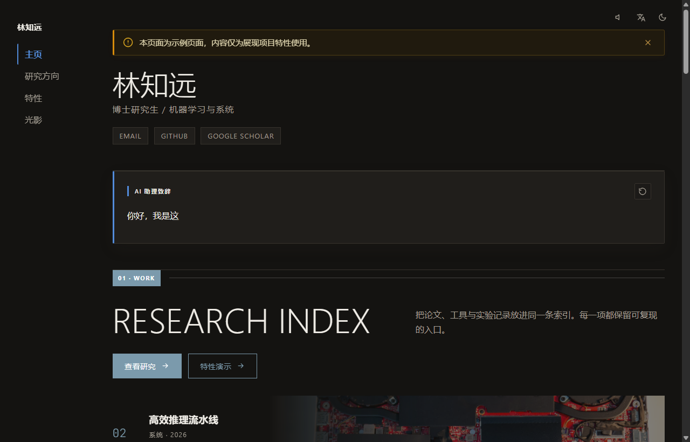
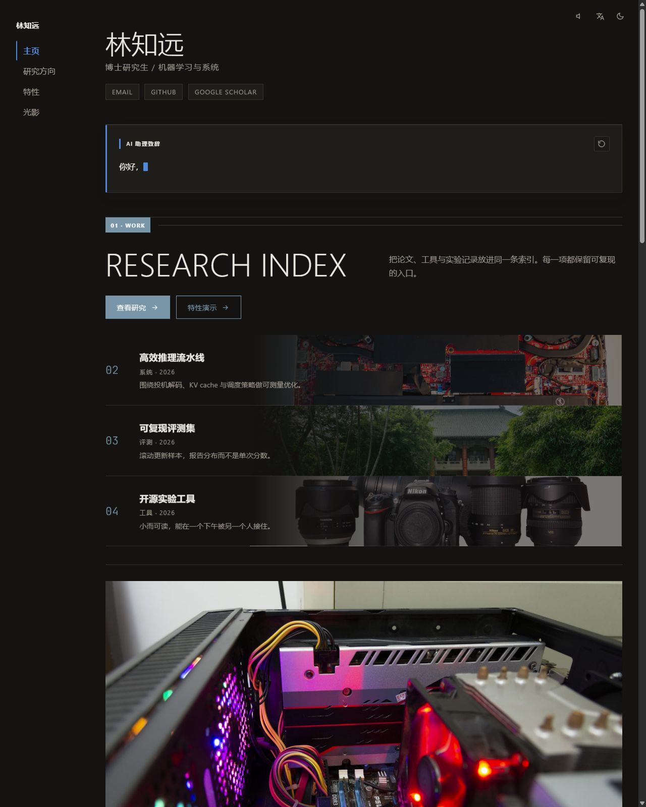
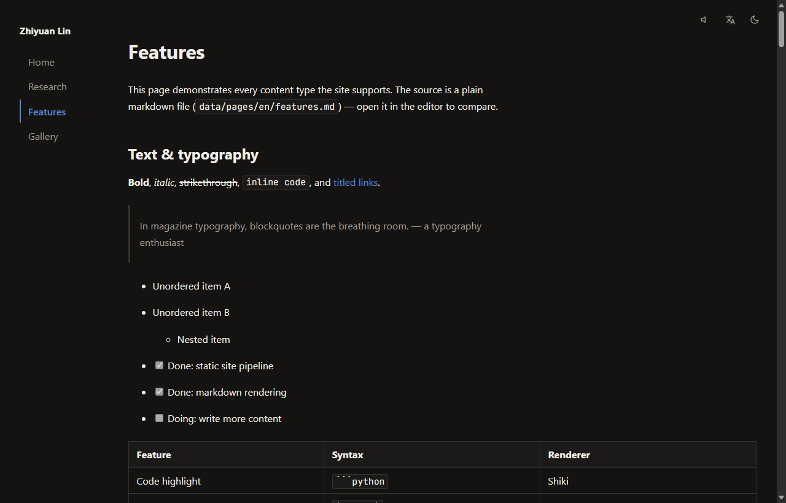
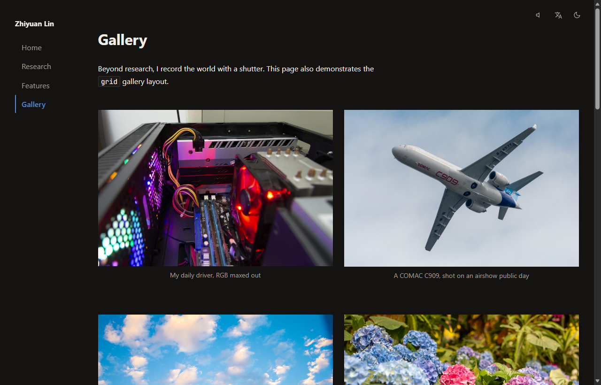

# OpenHomepage V2

[](https://stlin256.github.io/OpenHomepage-V2/)
[](https://github.com/stlin256/OpenHomepage-V2/actions/workflows/deploy.yml)
[](https://github.com/stlin256/OpenHomepage-V2/blob/master/LICENSE)

[中文文档](README.zh-CN.md) · [Live Demo](https://stlin256.github.io/OpenHomepage-V2/)

OpenHomepage V2 is a static, magazine-style personal homepage generator built with Astro. Designed with scholarly restraint and editorial typography, it is driven entirely by a local `data/` folder containing plain Markdown and YAML configuration files, and deployed seamlessly to GitHub Pages via GitHub Actions.

## Core Capabilities

- **Markdown & Directive Pipeline** — Standard GFM extended with Shiki dual-theme syntax highlighting, KaTeX mathematics, and expressive custom directives (`::bilibili`, `::youtube`, `:::video`, `:::audio`, `:::figure`, `::::grid`, `::stream`, `::ghcard`, `::editorial`).
- **Editorial Typography & Magazine Layout** — Asymmetric 12-column grid, restrained transform/opacity animations, configurable accent colors, and automatic light/dark theme switching (follows system preference with session override).
- **Dynamic Content Prefetching** — Build-time fetcher with intelligent cache fallback for GitHub contribution heatmaps, official-style pinned repository cards, and multi-source RSS content streams.
- **Interactive Multimedia** — Full-screen image lightbox with automatic `-full` resolution detection, persistent background audio across client navigation, and LLM-style typewriter markdown playback.
- **Zero-Friction Multilingual Architecture** — Add language subdirectories under `data/pages/<lang>/` to automatically activate routing, navigation, and multilingual configuration fields, complete with graceful fallback rendering.
- **Local Visual Editor (PC)** — Built-in local admin console (`npm run admin`) with on-page visual editing (hover outlines, in-place text editing, directive inspector, block insert/reorder/drag-and-drop, undo/redo), fallback whole-page markdown source editing, full-site config forms, automatic snapshots, and one-click data export.
- **Self-Hosted Static Server** — Direct production static serving via `npm run serve` with optional SSL certificate support.
- **Data Privacy & Decoupled CI** — Local `data/` content is git-ignored. GitHub Actions supports private data synchronization via secret URL, snapshot fallback, and demo mode.

## Page Components & UI Tour

### 1. Hero, Profile & Stream Components

- **Profile Card (`ProfileBlock`)**: Avatar (with automatic palette extraction), name, academic/professional bio, and social/research icon links (GitHub, Google Scholar, Email, etc.).
- **LLM Streaming Block (`StreamBlock`)**: Realistic LLM typewriter markdown animation with replay controls; features an in-page dual-column editor modal with real-time live preview during edit mode.
- **Floating Contact Card (`ContactCard`)**: Micro-card sliding in from the bottom right, with full-screen QR code modal popup (WeChat / Sponsorship).
- **Global Header Tools**: Site branding, multi-page navigation bar, persistent background audio player, language switcher dropdown, and zero-flash theme toggle.



### 2. Dynamic Content & Feed Components (GitHub & RSS)

- **GitHub Contribution Calendar (`GithubBlock`)**: Prefetched via GraphQL at build time, rendering a standard 5-level heat scale with interactive contribution tooltips.
- **Pinned Repository Cards**: 1:1 authentic GitHub visual styling with language color dots, Star/Fork counts, and topic tag badges.
- **Multi-Source RSS Stream (`RssBlock`)**: Aggregated article streams supporting chronological sorting (`latest`) and curated lists (`curated`), with feed tags, publication timestamps, lazy-loaded covers, and text clamping.



### 3. Markdown Directives & Media Layout

- **Mathematical Typography**: Native KaTeX integration rendering inline `$E=mc^2$` and display math `$$\int_0^1 x\,dx$$`.
- **Media Directives**: 16:9 responsive embed frames for `::bilibili` and `::youtube`, plus magazine-width native players for `:::video` and `:::audio`.
- **Structured Figures (`:::figure`)**: Custom image alignment (center, left, right), explicit width constraints, and styled captions.
- **Dual-Theme Code Highlighting**: Powered by Shiki with CSS variables seamlessly switching between light and dark palettes alongside the site theme.
- **Page Notice Banners (`NoticeBanner`)**: Configurable top banner alerts with accent, warning, and custom color presets.



### 4. Magazine Grid & Photo Gallery

- **12-Column Asymmetric Grid (`::::grid` / `:::cell`)**: Flexible container directives enabling modern multi-column magazine editorial layouts.
- **Photo Gallery Stream**: Responsive masonry layout for photography and creative assets, enriched with category kickers, titles, and metadata descriptions.
- **Full-Screen Image Lightbox**: Instant modal zoom on any article or gallery image with automatic high-resolution `-full` asset loading.



## Quick Start

```bash
# 1. Install dependencies
npm install

# 2. Initialize data directory from bundled sample
npm run setup

# 3. Start local development server
npm run dev

# 4. (Optional) Run tests and static production build
npm test
npm run build
```

*Note: If no `data/` folder is initialized, the site automatically falls back to `data.example/` for local preview and build.*

## CLI Commands

| Command | Description | Default URL | Lifecycle |
|---|---|---|---|
| `npm run admin` | Local visual editor (automatically manages companion preview server) | http://127.0.0.1:4174 + http://localhost:4321 | Press `Ctrl+C` to terminate both |
| `npm run dev` | Astro dev server with hot module reloading | http://localhost:4321 | Press `Ctrl+C` |
| `npm run prefetch` | Fetch remote GitHub activity and RSS articles into `.cache/` | — | Exits on completion |
| `npm test` | Run Vitest unit and integration test suite | — | Exits on completion |
| `npm run build` | Static production build outputting to `dist/` | — | Exits on completion |
| `npm run preview` | Preview static output in `dist/` | http://localhost:4321 | Press `Ctrl+C` |
| `npm run serve` | Standalone static server with optional HTTPS | http://localhost:8080 (or https://localhost:8443) | Press `Ctrl+C` |

## Visual Editor

Launch the editor locally on your PC:

```bash
npm run admin       # Access at http://127.0.0.1:4174 (loopback only)
```

- **On-Page Visual Editing**: The "Visual editing" button opens the real rendered page in edit mode — hover outlines, in-place text editing, a right-side inspector for directive parameters and grid columns, block insert/drag-reorder/cross-container move/delete, undo/redo (Ctrl+Z), a stream-block content editor modal with live preview (content fully expanded while editing), homepage config block forms, and page settings.
- **Source Fallback**: The admin page view keeps a frontmatter form and whole-page Markdown source editor (autosaves after idle).
- **Comprehensive Configuration**: Manage profile links, favicon generation, theme accent colors, GitHub settings, RSS subscriptions, streaming blocks, and homepage layout ordering.
- **Autosave & Version Snapshots**: Changes write to disk automatically after ~1.5s idle, with historical versions archived in `data/.snapshots/` for rollback.
- **Data Export**: The "Export data.zip" button archives your entire `data/` structure for secure hosting and CI consumption.

## Deployment & CI/CD

GitHub Actions automatically builds and publishes the static site to GitHub Pages on pushes to `main`/`master` and on a scheduled basis (every 8 hours).

### GitHub Secrets Configuration

| Secret | Description | Required |
|---|---|---|
| `ENABLE_EXAMPLE` | Set to `true` to deploy the demo showcase site using bundled `data.example/` in production mode | Optional (Demo Mode) |
| `DATA_SOURCE_URL` | Direct URL to download your private `data.zip` archive | Required for private data |
| `GH_PAT` | Personal Access Token (`read:user`) for GitHub contribution calendar GraphQL API | Optional |

- **Demo Deployment**: Setting `ENABLE_EXAMPLE` to `true` allows the repository to deploy a live showcase without exposing private personal data.
- **Fail-Safe Fallback**: If `DATA_SOURCE_URL` is unreachable, CI automatically falls back to the previous deployment snapshot, updates dynamic GitHub/RSS blocks, and triggers an email notification.

## Project Structure

```
├── data.example/    # Bundled sample data and assets (tracked in git)
├── data/            # User content and configuration (git-ignored)
├── docs/            # Architecture and technical specifications
├── scripts/         # Prefetch, setup, and static server scripts
├── src/             # Astro source code, components, layouts, and libraries
├── admin/           # Local visual editor application
└── tests/           # Vitest test suite
```

## License

This project is licensed under the [ISC License](LICENSE).
