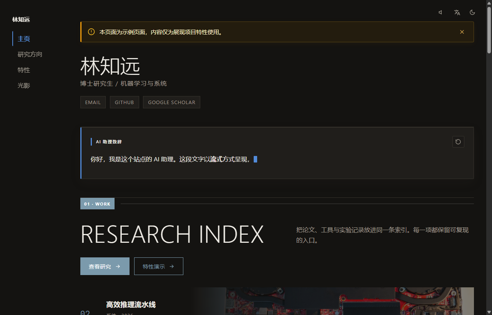
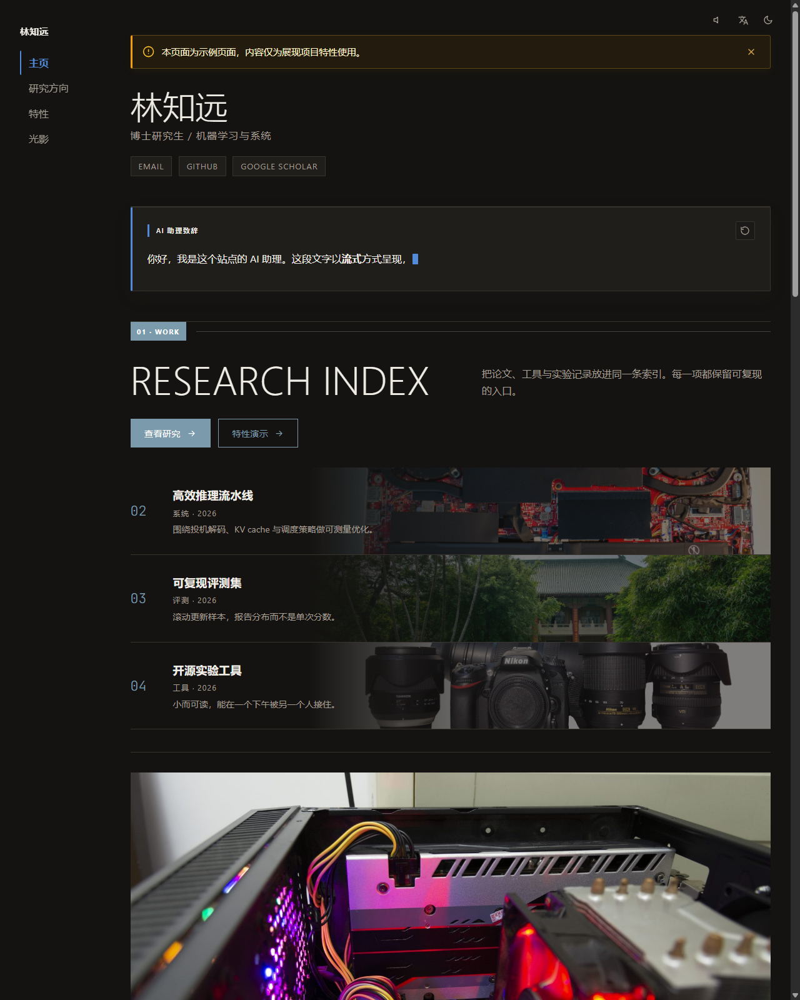
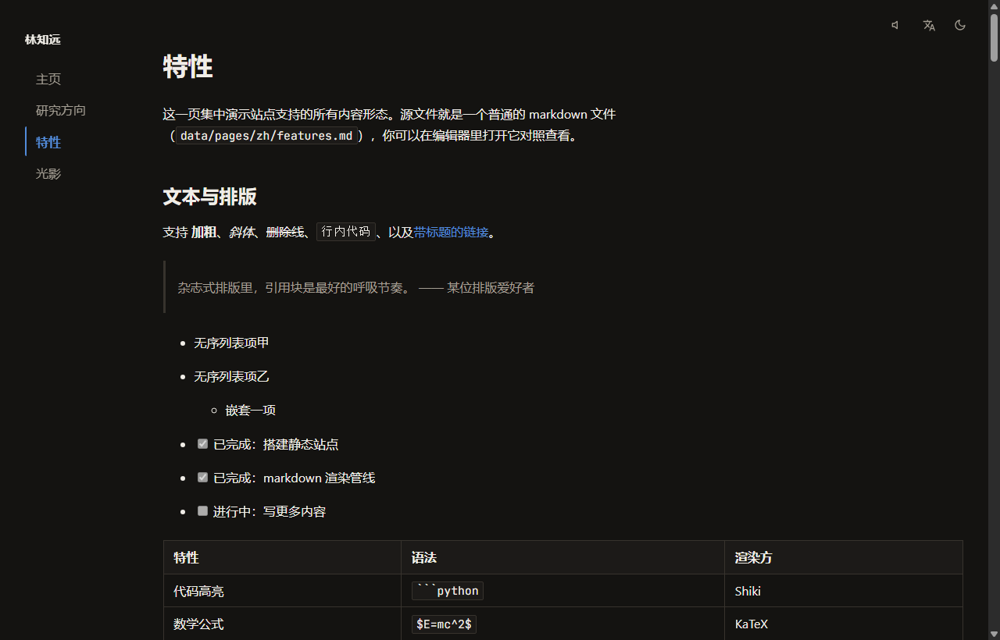

# OpenHomepage V2

[](https://stlin256.github.io/OpenHomepage-V2/)
[](https://github.com/stlin256/OpenHomepage-V2/actions/workflows/deploy.yml)
[](https://github.com/stlin256/OpenHomepage-V2/blob/master/LICENSE)

[English](README.md) · [在线演示 / Live Demo](https://stlin256.github.io/OpenHomepage-V2/)

OpenHomepage V2 是一款基于 Astro 构建的轻量级、杂志化排版纯静态个人主页生成器。全站采用科研主页式的严谨克制与现代杂志版式设计，内容与配置完全由本地 `data/` 目录中的 Markdown 和 YAML 文件驱动，并通过 GitHub Actions 自动化构建部署至 GitHub Pages。

## 核心特性

- **Markdown 优先与扩展指令**——原生支持 GFM、Shiki 明暗双主题代码高亮、KaTeX 数学公式解析，并提供丰富的自定义指令（`::bilibili`、`::youtube`、`:::video`、`:::audio`、`:::figure`、`::::grid`、`::stream`、`::ghcard`、`::editorial`）及安全 HTML 混写。
- **杂志化布局与自适应主题**——采用非对称 12 列网格布局与平滑硬件加速动效；内置明暗双主题（默认跟随系统偏好，支持手动切换与会话记忆）及自定义主题强调色。
- **自动图片优化与响应式加载**——生产构建自动生成多档分辨率 WebP，按当前布局和设备像素密度选择最小清晰档位；页面加载完成后空闲预取同语言其他 tab 及对应尺寸图片，同时保留原图与 `-full` 高清灯箱源且不参与预加载。
- **动态数据预取与缓存降级**——构建期预取 GitHub 年度贡献热力图、1:1 官网质感 Pinned 仓库卡片以及多源 RSS 文章卡片流，支持网络失败时的本地缓存平滑降级。
- **拟真交互与多媒体支持**——图片全屏灯箱（自动匹配 `-full` 高清源图）、站内无缝连续播放的背景音乐、以及拟真 LLM 打字机流式呈现的 Markdown 动画区块。
- **零开销多语言架构**——在 `data/pages/<lang>/` 下增设语言目录即可自动激活对应语言路由、导航与多语言配置，配合智能回退链实现静默兜底渲染。
- **本地可视化编辑器（PC）**——内置本地管理后台（`npm run admin`），页面正文在真实渲染页上直编（悬停描边、就地编辑、指令参数检查器、区块插入与拖拽排序、撤销/重做），后台另附页面源码兜底编辑与全站配置表单，配备自动保存、版本快照回滚与一键数据导出。
- **自托管静态服务器**——提供开箱即用的静态生产服务命令 `npm run serve`，支持自定义端口及 SSL/HTTPS 证书接入。
- **数据隐私与 CI/CD 解耦**——真实 `data/` 内容不入版本库；GitHub Actions 支持从私有直链下载数据、快照兜底容灾与演示示例部署。

## 页面控件与组件展示

### 1. 首页概览与流式组件 (Hero, Profile & Stream)

- **个人名片 (`ProfileBlock`)**：展示头像（支持自适应取色）、姓名、职位身份、研究方向与多语言简介，底部配备社交平台与学术主页图标链接行（GitHub、Scholar、Email 等）。
- **LLM 流式打字机 (`StreamBlock`)**：拟真模拟大模型流式打字机动画呈现 Markdown 内容，支持重播控制；在编辑模式下提供源码与实时预览双栏直编窗口。
- **悬浮联系卡片 (`ContactCard`)**：页面加载后在右下角延迟微动画弹出，支持点击呼出微信/赞赏等全屏二维码弹窗。
- **全局顶栏控件**：包含站点标题、多页面导航标签栏、持续播放背景音乐开关、多语言切换下拉菜单与首帧防闪烁明暗主题切换按钮。



### 2. 动态数据与内容流组件 (GitHub Activity & RSS Feeds)

- **GitHub 贡献热力图 (`GithubBlock`)**：构建期预取 GitHub GraphQL 贡献日历，渲染标准 5 档色阶热力图，支持桌面 Hover 与移动端点按查看贡献次数提示气泡。
- **Pinned 仓库卡片**：1:1 还原 GitHub 官方卡片视觉质感，实时呈现项目语言色标、Star / Fork 计数与 Topics 标签徽章。
- **多源 RSS 文章卡片流 (`RssBlock`)**：聚合博客与订阅源，支持最新发布时间排序（`latest`）与精选人工置顶（`curated`），配备文章来源 Tag、发布日期、封面懒加载及摘要截断。



### 3. Markdown 扩展指令与媒体排版 (Directives & Media)

- **数学公式渲染**：原生集成 KaTeX，支持行内公式 `$E=mc^2$` 与块级公式 `$$\int_0^1 x\,dx$$` 解析。
- **多媒体嵌入指令**：提供 `::bilibili`、`::youtube` 16:9 响应式播放器外框，以及 `:::video`、`:::audio` 原生全宽媒体控件。
- **结构化配图 (`:::figure`)**：支持图片居中/靠左/靠右对齐、显式百分比或像素宽度约束与居中美观图注。
- **双主题代码高亮**：基于 Shiki 的语法高亮引擎，产物内联明暗双套样式，随页面主题无缝实时切换。
- **页面通知横幅 (`NoticeBanner`)**：支持单页 frontmatter 独立配置的顶端弹出横幅，支持主题色、警示色与自定义色彩。



### 4. 杂志化网格与画廊相册 (Editorial Grids & Gallery)

- **12 列非对称网格 (`::::grid` / `:::cell`)**：容器指令支持 1–12 列自由切分，轻松实现双栏图文、三栏要点或复杂杂志版式。
- **画廊相册流**：针对摄影与视觉作品提供自适应图文排版，附带分类 Kicker、作品标题与元数据描述。
- **全屏图片预览灯箱**：全站所有正文与相册图片内置点击灯箱，自动探测并按需加载 `-full` 高清原图变体。


## 快速上手

```bash
# 1. 安装项目依赖
npm install

# 2. 从内置示例初始化数据目录
npm run setup

# 3. 启动本地开发服务器
npm run dev

# 4. （可选）运行测试与静态生产构建
npm test
npm run build
```

*注：未创建 `data/` 目录时，系统将自动使用内置的 `data.example/` 示例数据进行本地预览与构建。*

## 常用命令

| 命令 | 说明 | 默认地址 | 生命周期 |
|---|---|---|---|
| `npm run admin` | 启动本地可视化编辑器（自动托管站点预览服务） | http://127.0.0.1:4174 + http://localhost:4321 | 终端按 `Ctrl+C` 一并停止 |
| `npm run dev` | 仅启动 Astro 开发服务器（支持热更新） | http://localhost:4321 | 终端按 `Ctrl+C` 停止 |
| `npm run prefetch` | 预取远端 GitHub 与 RSS 数据到 `.cache/` | — | 运行完成自动退出 |
| `npm test` | 运行 Vitest 单元与集成测试套件 | — | 运行完成自动退出 |
| `npm run build` | 执行正式静态构建，并自动优化页面图片为 WebP | — | 运行完成自动退出 |
| `npm run preview` | 预览 `dist/` 生产构建产物 | http://localhost:4321 | 终端按 `Ctrl+C` 停止 |
| `npm run serve` | 运行生产级独立静态托管服务（可选 HTTPS） | http://localhost:8080（或 https://localhost:8443） | 终端按 `Ctrl+C` 停止 |

## 可视化编辑器

在 PC 本地终端运行以下命令：

```bash
npm run admin       # 访问 http://127.0.0.1:4174（仅监听本地回环地址）
```

- **渲染页直编**：后台页面视图点击「可视化编辑」，在真实渲染页面上直接编辑——悬停描边、文本块就地编辑、指令参数与网格列右侧检查器、区块插入/拖拽排序/跨容器移动/删除、撤销/重做（Ctrl+Z）、流式块内容弹窗编辑（编辑时内容完全展开且即时预览）、首页配置区块表单与页面设置面板。
- **源码兜底编辑**：后台页面视图保留 frontmatter 表单与整页 Markdown 源码编辑（停顿自动保存）。
- **全站可视化配置**：支持站点信息、头像取色与自定义强调色、Favicon 自动裁切生成、背景音乐、GitHub/RSS 订阅源以及主页区块自由拖拽重排。
- **自动保存与快照机制**：编辑停顿约 1.5 秒自动写盘，每次变更前将前一版本备份至 `data/.snapshots/`，支持历史版本查看与一键回滚。
- **数据导出**：顶栏一键导出 `data.zip` 压缩包，方便上传到私有存储或 Release 供 CI 自动化抓取。

## 部署与持续集成

GitHub Actions 会在代码推送到 `main`/`master` 分支或每 8 小时定时触发构建并自动发布至 GitHub Pages。

### GitHub Secrets 配置项

| Secret 变量名 | 说明 | 适用场景 |
|---|---|---|
| `ENABLE_EXAMPLE` | 设为 `true` 时启用示例演示模式，直接使用内置 `data.example/` 进行正式生产部署 | 演示 / 体验部署 |
| `DATA_SOURCE_URL` | 存放私有 `data.zip` 数据压缩包的直接下载链接 | 私有数据正式部署 |
| `GH_PAT` | 具备 `read:user` 权限的 GitHub Token，用于 GraphQL 贡献图数据抓取 | 贡献图完整展示 |

- **示例演示模式**：设置 `ENABLE_EXAMPLE: true` 时，工作流会自动使用内置示例进行正式生产部署，无需配置私有直链即可展示完整效果。
- **容灾快照回退**：若配置的 `DATA_SOURCE_URL` 失效，工作流会自动拉取上一次成功部署的快照进行构建，更新 GitHub/RSS 动态内容后完成部署，并触发邮件提醒。

## 项目结构

```
├── data.example/    # 内置示例数据与媒体资源（版本库跟踪）
├── data/            # 用户真实内容与配置（不入库，由 .gitignore 忽略）
├── docs/            # 设计文档与技术规范说明
├── scripts/         # 数据预取、环境初始化与静态服务脚本
├── src/             # Astro 页面源码、组件、布局与核心工具库
├── admin/           # 本地可视化编辑器服务端与前端源码
└── tests/           # Vitest 自动化测试套件
```

## 开源协议

本项目基于 [ISC License](LICENSE) 协议开源。
