# OpenHomepage V2

[](https://stlin256.github.io/OpenHomepage-V2/)
[](https://github.com/stlin256/OpenHomepage-V2/actions/workflows/deploy.yml)
[](https://deepwiki.com/stlin256/OpenHomepage-V2)

[English](README.md) · [在线演示 / Live Demo](https://stlin256.github.io/OpenHomepage-V2/)

OpenHomepage V2 是一款基于 Astro 构建的轻量级、杂志化排版纯静态个人主页生成器。全站采用科研主页式的严谨克制与现代杂志版式设计，内容与配置完全由本地 `data/` 目录中的 Markdown 和 YAML 文件驱动，并通过 GitHub Actions 自动化构建部署至 GitHub Pages。

## 核心特性

- **Markdown 与科研学术排版**——原生支持 GFM、Shiki 明暗双主题代码高亮、KaTeX 数学公式解析、学术成果与 BibTeX 一键复制（`::publications`）、经历与里程碑时间线（`::::timeline` / `:::timeline-item`）、杂志风注记卡片（`:::note`、`:::tip`、`:::warning`、`:::important`、`:::quote`）以及丰富的多媒体指令（`::bilibili`、`::youtube`、`:::video`、`:::audio`、`:::figure`、`::::grid`、`::stream`、`::ghcard`、`::editorial`）。
- **静态全局搜索与原创 Feed**——支持 `Ctrl+K` / `Cmd+K` 快捷唤起毛玻璃静态全局搜索（含中英文分词与多语言作用域切换）；构建期自动生成本站原创 RSS 2.0（`/feed.xml`）、Atom 1.0（`/feed.atom.xml`）与 JSON Feed 1.1（`/feed.json`）。
- **动态 OG 社交卡片与长文导航**——构建期自动生成 1200×630 杂志风社交分享图（按内容 hash 智能缓存）；长文自动提取目录（TOC），桌面端粘性浮动吸顶，移动端折叠导航，配合 ScrollSpy 与顶部细线阅读进度条；支持多曲目 BGM 播放列表与抽屉面板。
- **杂志化布局与自适应主题**——采用非对称 12 列网格布局与平滑硬件加速动效；内置明暗双主题（默认跟随系统偏好，支持手动切换与会话记忆）及自定义主题强调色。
- **自动图片优化与响应式加载**——生产构建自动生成多档分辨率 WebP 与 AVIF，浏览器支持 AVIF 时经 `<picture>` 优先加载更小的 AVIF（WebP 兜底），并按当前布局和设备像素密度选择最小清晰档位；页面加载完成后无字节上限地激进空闲预取其他语言页面、同语言其他 tab 及对应 AVIF 候选图（HTML 进共享内存缓存，语言切换近乎瞬时），Chromium 另用 prefetch-only Speculation Rules 预热 hover 目标；同时保留原图与 `-full` 高清灯箱源且不参与预加载。
- **动态数据预取与缓存降级**——构建期预取 GitHub 年度贡献热力图、1:1 官网质感 Pinned 仓库卡片以及多源 RSS 文章卡片流，支持网络失败时的本地缓存平滑降级。
- **拟真交互与多媒体支持**——图片全屏灯箱（自动匹配 `-full` 高清源图）、站内无缝连续播放的背景音乐、以及拟真 LLM 打字机流式呈现的 Markdown 动画区块。
- **零开销多语言架构**——在 `data/pages/<lang>/` 下增设语言目录即可自动激活对应语言路由、导航与多语言配置，配合智能回退链实现静默兜底渲染。内置示例站点自带 中文 / English / 日本語 / Français 四种语言演示。
- **本地可视化编辑器（PC）**——内置本地管理后台（`npm run admin`），页面正文在真实渲染页上直编（悬停描边、就地编辑、指令参数检查器、区块插入与拖拽排序、撤销/重做），后台另附页面源码兜底编辑与全站配置表单，配备自动保存、版本快照回滚与一键数据导出。
- **自托管静态服务器**——提供开箱即用的静态生产服务命令 `npm run serve`，支持自定义端口及 SSL/HTTPS 证书接入。
- **数据隐私与 CI/CD 解耦**——真实 `data/` 内容不入版本库；GitHub Actions 支持从私有直链下载数据、快照兜底容灾与演示示例部署。

## 组件画廊

以下每个组件都取自生产构建的单独截图（`npm run screenshots` 一键重新生成）——所见即所得。

### 主页区块

**个人名片（ProfileBlock）**——头像（支持自适应取色）、姓名、身份简介与社交/学术主页链接行。


**LLM 流式区块（StreamBlock）**——拟真大模型打字机动画呈现预写 Markdown，支持重播与速度调节。

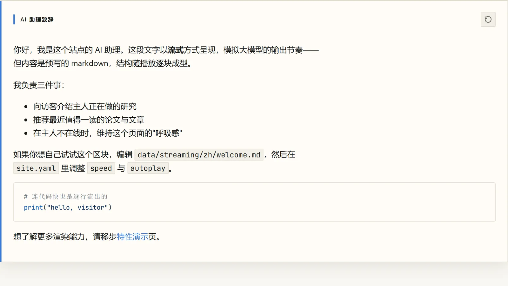

**编辑风展示区块（`::editorial`）**——按钮组、编号列表卡、图片磁贴、归档卡与分割线的自由组合，完全由 `site.yaml` 定义。


**GitHub 贡献热力图**——构建期 GraphQL 预取贡献日历，5 档主题色阶、月份/星期坐标轴与逐日提示气泡；色阶变量只注入区块根节点，不在数百个格子上重复。

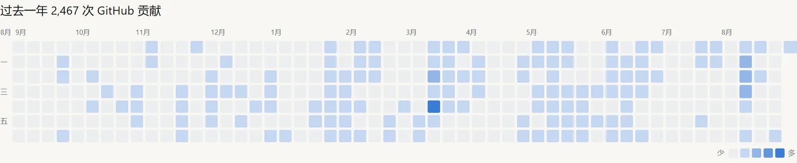

**Pinned 仓库卡片**——1:1 还原 GitHub 官网质感：语言色点、Star/Fork 计数、Topics 标签与本地化相对时间。

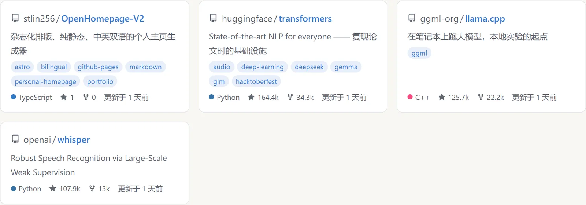

**RSS 区块（RssBlock）**——多源文章卡片流，支持最新排序（`latest`）与精选置顶（`curated`），含来源标签、日期与封面懒加载。

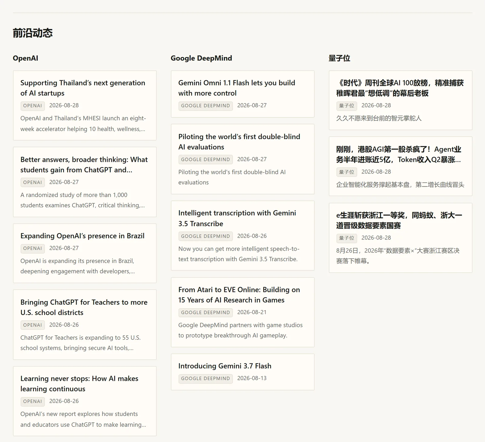

### Markdown 与指令渲染

**双主题代码高亮**——Shiki 引擎内联明暗双套样式，随站点主题无缝切换。

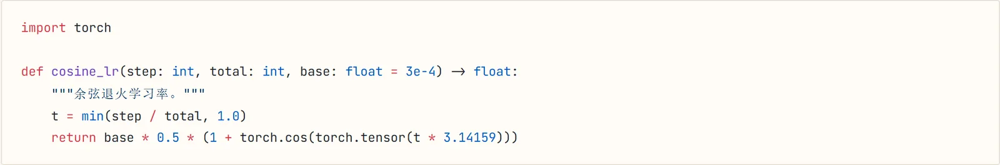

**KaTeX 数学公式**——行内 `$...$` 与块级公式原生渲染。


**结构化配图（`:::figure`）**——对齐方式、显式宽度约束与美观图注。


**杂志化网格（`::::grid` / `:::cell`）**——12 列非对称版式，移动端自动塌缩为单栏。


**自渲染音频与内嵌媒体（`:::audio` / `:::video`）**——轻量自渲染音频播放器（紧凑标题与封面卡片双模式，带超长文字缓动与独占播放/背景音乐智能续播）；`:::video` 及 16:9 响应式 `::bilibili` / `::youtube` 嵌入。

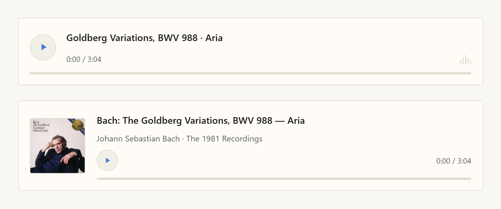

**视频嵌入卡片（`::bilibili` / `::youtube`）**——16:9 响应式官方门面卡片，展示封面、自动解析的标题栏与播放按钮；点击后才加载第三方 iframe。

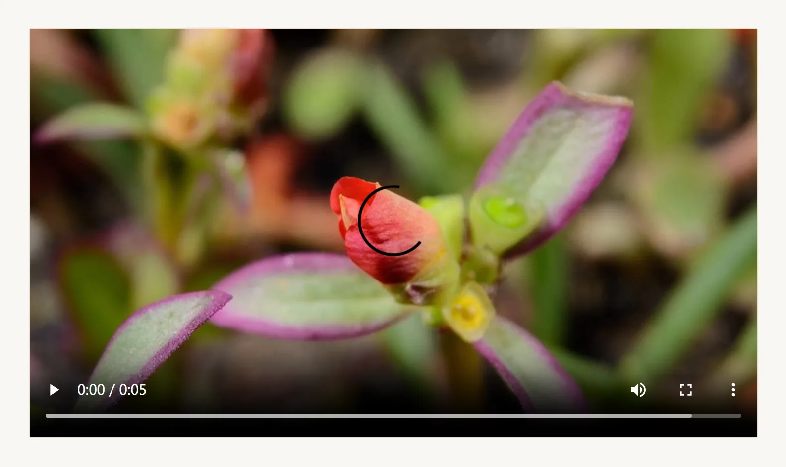

**GitHub 仓库卡（`::ghcard`）**——在正文任意位置内嵌 pinned 仓库卡片。


**杂志风注记卡片（`:::note` / `:::tip` / `:::warning` / `:::important` / `:::quote`）**——零 JS 语义化注记卡片，自动匹配主题强调色与自适应明暗背景。


**经历与里程碑时间线（`::::timeline` / `:::timeline-item`）**——极简杂志风学术/工作经历时间轴，配备节点指示器与展开动效，自适应移动端与桌面端布局。


**学术成果列表（`::publications`）**——构建期多维过滤、分组与排序学术成果条目，支持一键复制 BibTeX 与平滑展开折叠的摘要过渡动画。

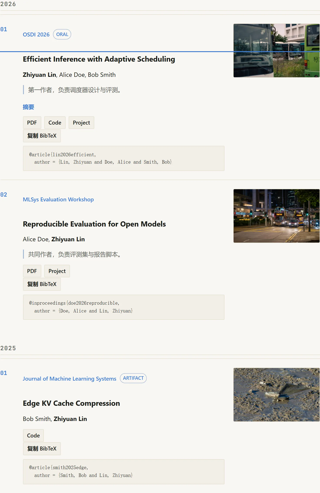

**长文目录与阅读进度条（`toc: true`）**——桌面端智能粘性侧边栏、移动端底部抽屉导航，支持 ScrollSpy 视口跟随与顶部 2px 精准阅读进度条。


### 全局控件与交互

**顶栏工具区**——背景音乐开关、语言切换器、全局搜索与首帧防闪烁主题切换。


**全局静态搜索（`Ctrl+K` / `Cmd+K`）**——支持多语言作用域切换（当前语言/全部语言）、中英文与 CJK 分词匹配、键盘快速导航与平滑打开/关闭过渡动画的杂志风搜索弹窗。

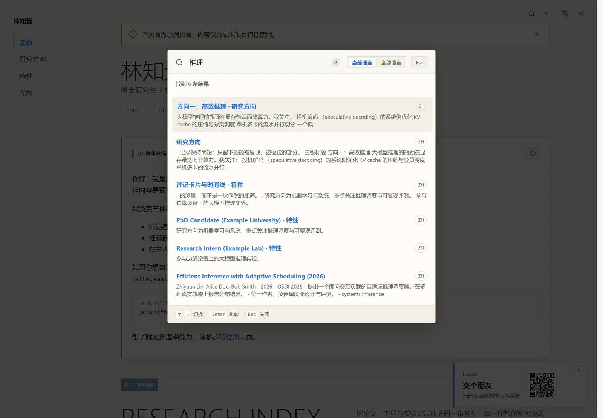

**BGM 播放列表与抽屉迷你播放器**——支持多曲目播放列表抽屉、曲目切换、音量记忆与调节、多媒体冲突暂停与智能自动续播。

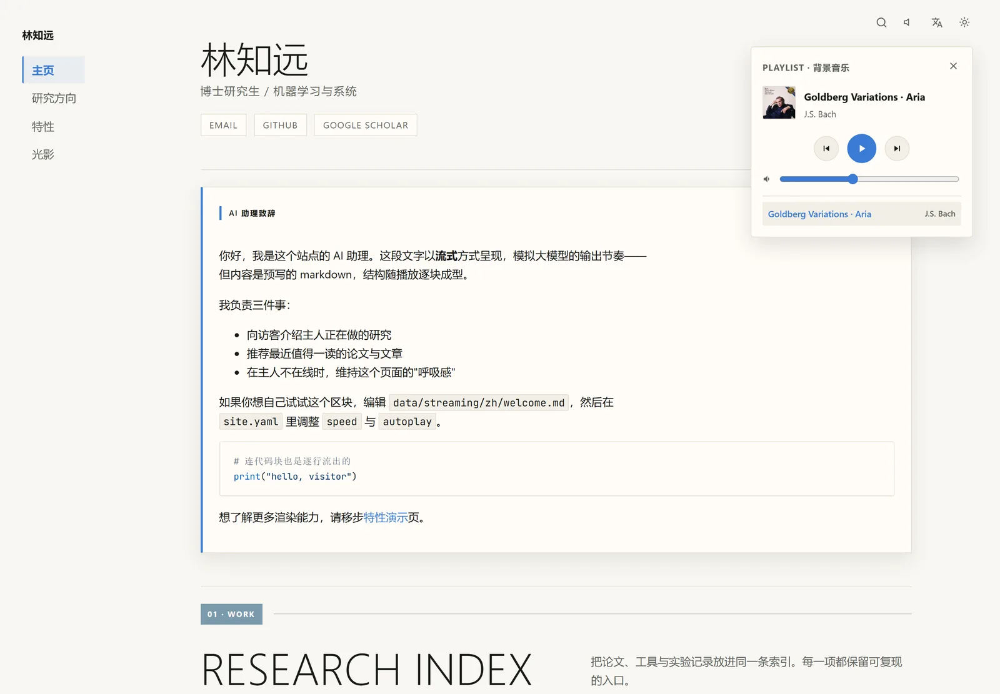

**语言切换器**——一个目录即一种语言；演示站内置 中文 / English / 日本語 / Français，缺译页面静默回退。

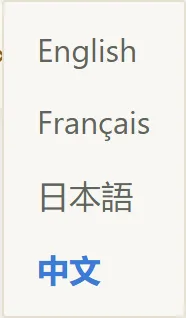

**页面通知横幅（NoticeBanner）**——单页 frontmatter 独立配置的顶端横幅，支持主题色 / 黄 / 红 / 自定义色。


**联系卡与二维码弹窗（ContactCard）**——右下角延迟滑入的微卡片，点击呼出全屏二维码弹窗。

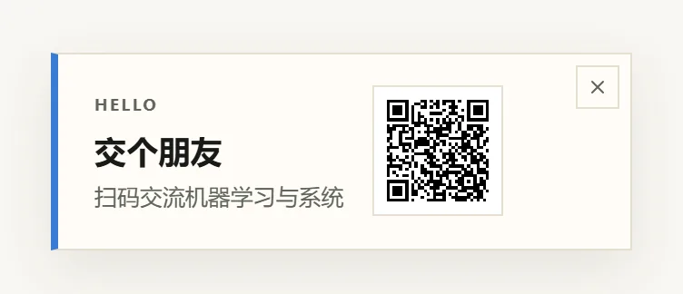

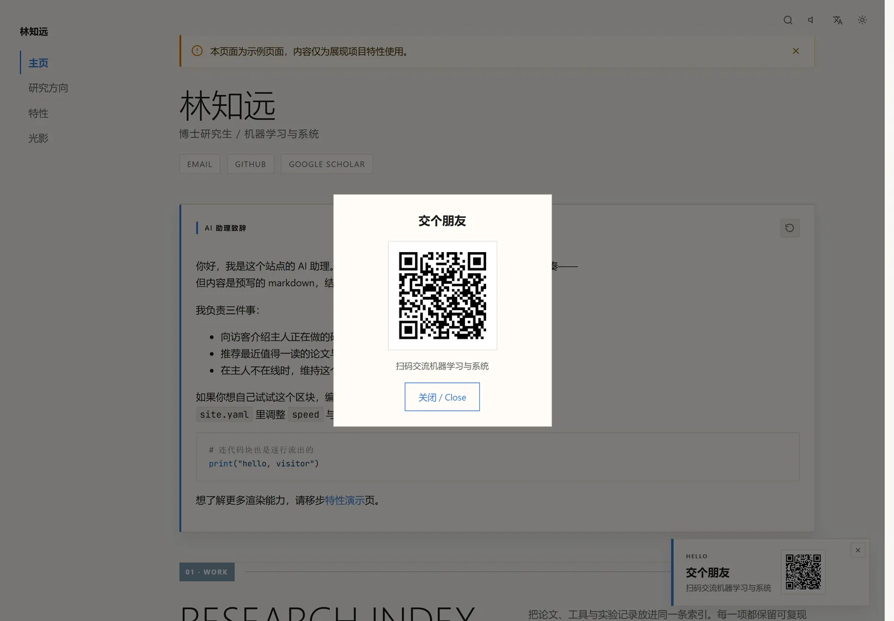

**画廊与灯箱**——带图注的网格相册；任意图片点击即开全屏灯箱，自动加载 `-full` 高清原图。

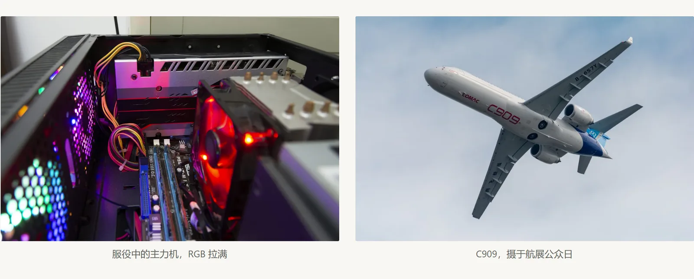

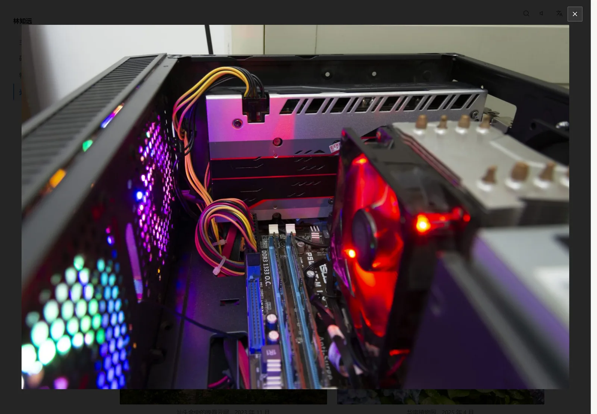

**暗色主题**——跟随系统并支持会话记忆，所有组件均有明暗双主题。


## 快速上手

```bash
# 1. 安装项目依赖
npm install

# 2. 从内置示例初始化数据目录
npm run setup

# 3. 启动本地开发服务器
npm run dev

# 4. （可选）运行测试与静态生产构建
npm test
npm run build
```

*注：未创建 `data/` 目录时，系统将自动使用内置的 `data.example/` 示例数据进行本地预览与构建。*

## 常用命令

| 命令 | 说明 | 默认地址 | 生命周期 |
|---|---|---|---|
| `npm run admin` | 启动本地可视化编辑器（自动托管站点预览服务） | http://127.0.0.1:4174 + http://localhost:4321 | 终端按 `Ctrl+C` 一并停止 |
| `npm run dev` | 仅启动 Astro 开发服务器（支持热更新） | http://localhost:4321 | 终端按 `Ctrl+C` 停止 |
| `npm run prefetch` | 预取远端 GitHub 与 RSS 数据到 `.cache/` | — | 运行完成自动退出 |
| `npm test` | 运行 Vitest 单元与集成测试套件 | — | 运行完成自动退出 |
| `npm run build` | 执行正式静态构建，并自动优化页面图片为 WebP + AVIF（默认 `WEBP_QUALITY` 80 / `AVIF_QUALITY` 50） | — | 运行完成自动退出 |
| `npm run preview` | 预览 `dist/` 生产构建产物 | http://localhost:4321 | 终端按 `Ctrl+C` 停止 |
| `npm run serve` | 运行生产级独立静态托管服务（可选 HTTPS） | http://localhost:8080（或 https://localhost:8443） | 终端按 `Ctrl+C` 停止 |
| `npm run screenshots` | 从 `dist/` 重新生成上文组件画廊截图（需先 `npm run build`，首次运行需 `npx playwright install chromium`） | — | 运行完成自动退出 |

## 可视化编辑器

在 PC 本地终端运行以下命令：

```bash
npm run admin       # 访问 http://127.0.0.1:4174（仅监听本地回环地址）
```

- **渲染页直编**：后台页面视图点击「可视化编辑」，在真实渲染页面上直接编辑——悬停描边、文本块就地编辑、指令参数与网格列右侧检查器、区块插入/拖拽排序/跨容器移动/删除、撤销/重做（Ctrl+Z）、流式块内容弹窗编辑（编辑时内容完全展开且即时预览）、首页配置区块表单与页面设置面板（含长文目录开启智能检测与一键启用）。
- **源码兜底编辑**：后台页面视图保留 frontmatter 表单与整页 Markdown 源码编辑（停顿自动保存）。
- **全站可视化配置**：支持站点信息、头像取色与自定义强调色、Favicon 自动裁切生成、背景音乐与播放列表、GitHub/RSS 订阅源以及主页区块自由拖拽重排。
- **自动保存与快照机制**：编辑停顿约 1.5 秒自动写盘，每次变更前将前一版本备份至 `data/.snapshots/`，支持历史版本查看与一键回滚。
- **数据导出**：顶栏一键导出 `data.zip` 压缩包，方便上传到私有存储或 Release 供 CI 自动化抓取。

## 部署与持续集成

GitHub Actions 会在代码推送到 `main`/`master` 分支或每 8 小时定时触发构建并自动发布至 GitHub Pages。

### GitHub Secrets 配置项

| Secret 变量名 | 说明 | 适用场景 |
|---|---|---|
| `ENABLE_EXAMPLE` | 设为 `true` 时启用示例演示模式，直接使用内置 `data.example/` 进行正式生产部署 | 演示 / 体验部署 |
| `DATA_SOURCE_URL` | 存放私有 `data.zip` 数据压缩包的直接下载链接 | 私有数据正式部署 |
| `GH_PAT` | 具备 `read:user` 权限的 GitHub Token，用于 GraphQL 贡献图数据抓取 | 贡献图完整展示 |

- **示例演示模式**：设置 `ENABLE_EXAMPLE: true` 时，工作流会自动使用内置示例进行正式生产部署，无需配置私有直链即可展示完整效果。
- **容灾快照回退**：若配置的 `DATA_SOURCE_URL` 失效，工作流会自动拉取上一次成功部署的快照进行构建，更新 GitHub/RSS 动态内容后完成部署，并触发邮件提醒。

## 项目结构

```
├── data.example/    # 内置示例数据与媒体资源（版本库跟踪）
├── data/            # 用户真实内容与配置（不入库，由 .gitignore 忽略）
├── docs/            # 设计文档与技术规范说明
├── scripts/         # 数据预取、环境初始化与静态服务脚本
├── src/             # Astro 页面源码、组件、布局与核心工具库
├── admin/           # 本地可视化编辑器服务端与前端源码
└── tests/           # Vitest 自动化测试套件
```
